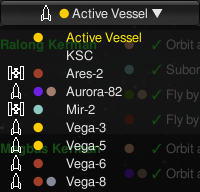

# Are We There Yet?

A small KSP mod that shows what tourist contract tasks are still pending for Kerbals on the active vessel, in the crew roster, or on any other vessel with tourists aboard.

Tired of checking each tourist to remember who still needs to go where? This mod lists all incomplete tourist tasks from active contracts in a single window — one click on the toolbar button and you know exactly who still needs to fly by, orbit, or land where.

## How It Works

The mod finds tourists from the selected source (active vessel, crew roster, or another vessel with tourists aboard) and searches active contracts for their incomplete tasks. Tasks are displayed in a scrollable window.

The toolbar button is available in **Flight**, **Map View**, **VAB**, **SPH**, and **Space Center** scenes. 


Click it to open the "Are We There Yet?" window, click again to close. The task list updates automatically when contract parameters change.


Colored circles before each task indicate the destination body:

- One circle (●) for a planet or the Sun — the circle color matches the body's orbit
- Two circles (● ●) for a moon — the left circle is the parent planet, the right circle is the moon

Colors are defined in `Colors.cfg` and can be customized for any body.

A **Show completed** checkbox at the top of the window toggles display of completed tasks. Completed tasks are marked with a green checkmark (✓).



A **source** dropdown lets you choose where to look for tourists:

- **Active Vessel** (flight only) — shows tasks for Kerbals aboard the currently active vessel
- **KSC** — shows tasks for all tourists in the crew roster (available in all scenes)
- **Individual vessels** — shows tasks for tourists on vessels with crew capacity that have tourists aboard

Each source entry shows a vessel type icon and colored SOI circles indicating the vessel's current sphere of influence.


A **destination filter** dropdown lets you narrow the task list to a specific planet or moon. Selecting a planet also shows tasks for all its moons.

## Settings

Open **ESC => Settings => Difficulty Options => Are We There Yet?** to configure:

- **Show destination body indicators** — toggles the colored circles (●) before each task and in the source vessel dropdown

Body colors can be customized in `GameData/AreWeThereYet/Colors.cfg`.

## Installation

1. Download the latest release.
2. Extract the `GameData/AreWeThereYet` folder into your KSP `GameData/` directory.
3. The final structure should be:

```
GameData/AreWeThereYet/
├── Plugins/
│   └── AreWeThereYet.dll
├── Textures/
│   ├── AreWeThereYet.png
│   ├── VTBase.png
│   ├── VTLander.png
│   ├── VTPlane.png
│   ├── VTProbe.png
│   ├── VTRelay.png
│   ├── VTRover.png
│   ├── VTShip.png
│   └── VTStation.png
├── Colors.cfg
├── LICENSE
└── README.md
```

## Building from Source

### Prerequisites

- .NET Framework SDK or Mono
- MSBuild
- A KSP installation with `KSP_Data/Managed/` containing the required assemblies

### Setup

1. Clone the repository:
   ```
   git clone https://github.com/crvx/AreWeThereYet.git
   cd AreWeThereYet
   ```

2. Create a symlink (Linux) or junction (Windows) named `KSP_Data` inside the `AreWeThereYet/` folder, pointing to your KSP installation's `KSP_Data` directory:

   **Linux:**
   ```bash
   ln -s /path/to/Kerbal\ Space\ Program/KSP_Data AreWeThereYet/KSP_Data
   ```

   **Windows (admin prompt):**
   ```cmd
   mklink /J AreWeThereYet\KSP_Data C:\Path\To\KSP\KSP_Data
   ```

   The `AreWeThereYet.csproj` references assemblies via `KSP_Data\Managed\*.dll`, so this symlink is required for compilation.

### Build

   ```bash
   msbuild AreWeThereYet/AreWeThereYet.csproj /p:Configuration=Release /t:Build
   ```

The compiled DLL will be at `AreWeThereYet/bin/Release/AreWeThereYet.dll`.

## License

MIT License. Copyright © crvx.
